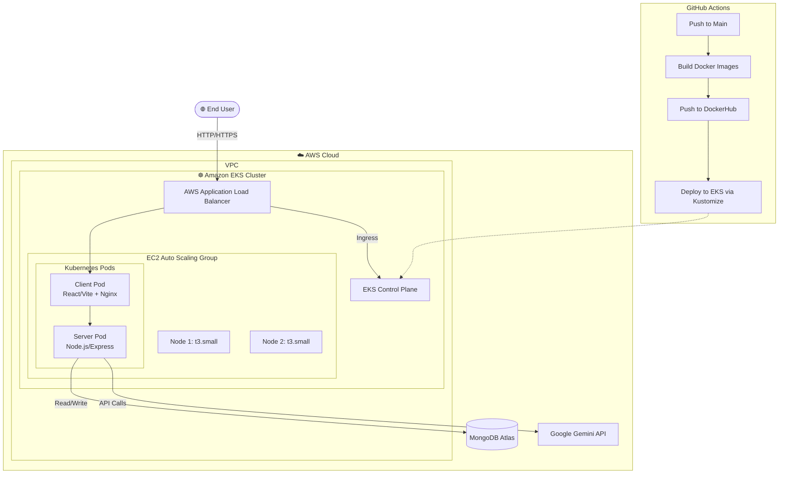

<div align="center">
  <h1>🚀 LinguistAI - Production DevOps Infrastructure</h1>
  <p><strong>Transforming a MERN application into a highly available, self-healing Cloud Native Application using AWS EKS, Terraform, and GitHub Actions.</strong></p>
</div>

<br />

## 📖 Introduction

LinguistAI is an AI-powered language translation and chat platform. While the core application is built using the MERN stack (MongoDB, Express, React, Node.js), this repository showcases the **end-to-end DevOps lifecycle** required to take it from a local development environment to a production-ready, fault-tolerant cloud architecture.

This project is a comprehensive demonstration of modern DevOps practices, encompassing Infrastructure as Code (IaC), container orchestration, automated CI/CD pipelines, and robust security principles.

---

## 🏗️ DevOps Architecture

The infrastructure is fully deployed on **AWS (Amazon Web Services)** using **Terraform** for Infrastructure as Code, and **Amazon EKS (Elastic Kubernetes Service)** for container orchestration. 



### Architecture Highlights
- **High Availability:** Deployed across multiple AWS Availability Zones using an EKS Managed Node Group with an Auto Scaling Group.
- **Self-Healing:** If an EC2 node or application pod crashes, Kubernetes and AWS Auto Scaling automatically provision replacements with zero downtime.
- **Zero-Downtime Deployments:** Kubernetes Rolling Updates ensure that new versions of the application are seamlessly phased in.
- **Security First:** Containers run as non-root users, sensitive variables are injected via Kubernetes Secrets, and VPC subnets isolate workloads.

---

## 🔄 CI/CD Workflow

The entire deployment lifecycle is completely automated using **GitHub Actions**.

1. **Continuous Integration (CI):**
   - On every push to the `main` branch, the CI pipeline triggers.
   - It builds the `linguistai-client` and `linguistai-server` Docker images.
   - The images are tagged with the specific Git commit SHA and pushed to DockerHub.

2. **Continuous Deployment (CD):**
   - After a successful build, the CD pipeline authenticates with the AWS EKS cluster.
   - It updates the Kubernetes manifests dynamically using **Kustomize** to point to the newly built Docker image tags.
   - The updated manifests are applied to the EKS cluster, triggering a Rolling Update.
   - A final Smoke Test verifies that the newly deployed pods are healthy before marking the pipeline as successful.

---

## 🛠 Technology Stack

| Category | Technologies |
| :--- | :--- |
| **Cloud Provider** | AWS (VPC, EKS, EC2, ELB, IAM) |
| **Infrastructure as Code** | Terraform |
| **Containerization** | Docker, DockerHub |
| **Orchestration** | Kubernetes, Kustomize |
| **CI/CD** | GitHub Actions |
| **Frontend** | React, Vite, Nginx |
| **Backend** | Node.js, Express.js |
| **Database** | MongoDB Atlas |

---

## 🚀 Getting Started

Want to spin up this infrastructure yourself? Follow these steps.

### Prerequisites
- [AWS CLI](https://aws.amazon.com/cli/) installed and configured (`aws configure`).
- [Terraform](https://www.terraform.io/downloads) installed.
- [Docker](https://docs.docker.com/get-docker/) installed.
- [kubectl](https://kubernetes.io/docs/tasks/tools/) installed.
- A MongoDB Atlas connection string.
- A Google Gemini API key.

### 1. Clone the Repository
```bash
git clone https://github.com/shubham-gayke/linguistai-devops.git
cd linguistai-devops
```

### 2. Provision Infrastructure (Terraform)
Navigate to the Terraform directory to spin up the VPC and EKS cluster.
```bash
cd terraform
terraform init
terraform plan
terraform apply --auto-approve
```
*Note: EKS cluster creation usually takes about 10-15 minutes.*

### 3. Connect to the EKS Cluster
Once Terraform completes, update your local kubeconfig:
```bash
aws eks update-kubeconfig --name linguistai-cluster-dev --region ap-south-1
```

### 4. Configure Secrets
Create a `.env` file or manually apply your Kubernetes secrets:
```bash
kubectl create namespace linguistai
kubectl create secret generic linguistai-secrets \
  --from-literal=MONGODB_URI="your_mongodb_uri" \
  --from-literal=GEMINI_API_KEY="your_api_key" \
  --namespace=linguistai
```

### 5. Deploy the Application
Deploy the application using Kustomize:
```bash
kubectl apply -k kubernetes/base
```

### 6. Access the Application
The frontend is exposed via an AWS Application Load Balancer. Retrieve the URL:
```bash
kubectl get svc linguistai-client -n linguistai
```
Copy the `EXTERNAL-IP` (e.g., `xxx.elb.amazonaws.com`) and paste it into your browser!

---

## 👨‍💻 Author

**Shubham Gayke**  
DevOps Engineer | Cloud | Linux | AWS | Kubernetes

⭐ *If you found this project helpful, please consider giving it a star!*